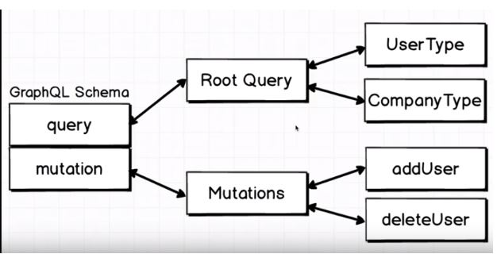

This repository is for the basic understanding of graphQL CRUD operations.



Run Application   
1st Terminal: npm run json:server  
2nd Terminal: node server.js  


#GetAll users
http://localhost:3000/users

#Get user with specific ID 
```js
{
  user(id: "23") {
    id
    firstName
    age
    company {
      id
      name
    }
  }
}
```

#Get all users in company with specific ID
```js
{
  company(id:"1") {
		users {
		  id
      firstName
		}
  }
}
```

#Add User and output id, firstname,age
```js
mutation {
  addUser(firstName:"Jane Doe",age:28){
    id
    firstName
    age
  }
}
```

#Delete user by ID
```js
mutation {
  deleteUser(id:"RPHcuVk") { //add id here
    id
  } 
}
```

#Edit user
```js
mutation {
  editUser(id:"uiVtkA5",firstName:"Reva",age:28){
    id
    firstName
    age
  }
}
```
